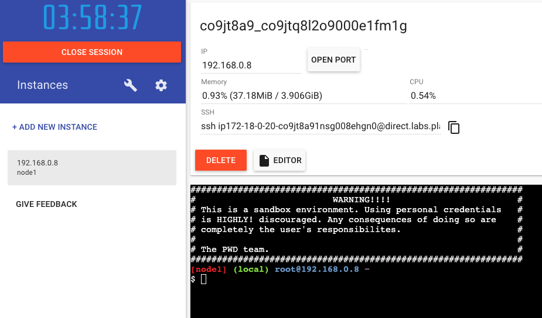

## Aula 1 - Container Technologies

### Exercicio 1 - Docker image

Realizar a contrução de uma imagem, conhecer alguns comandos comuns e realizar o push da imagem para o dockerhub.

### Instruções que pode ser utilizada no Dockerfile

| **Instrução**   | **Descrição**                                                   |
|-------------|-------------------------------------------------------------|
| ADD         | Adicione arquivos e diretórios locais ou remotos.           |
| ARG         | Use variáveis de tempo de build                             |
| CMD         | Especifique comandos padrão.                                |
| COPY        | Copie arquivo e diretórios                                  |
| ENTRYPOINT  | Especifique o executável padrão                             |
| ENV         | Definir variáveis de ambiente                               |
| EXPOSE      | Descreva em quais portas seu aplicativo está escutando      |
| FROM        | Crie um novo build a partir de uma imagem base.             |
| HEALTHCHECK | Verifique a integridade de um contêiner na inicialização    |
| LABEL       | Adicione metadados a uma imagem                             |
| MAINTAINER  | Especifica o autor da imagem                                |
| ONBUILD     | Especifique instruções para quando a imagem for usada em um build. |
| RUN         | Execute comandos                                            |
| SHELL       | Defina o shell padrão de uma imagem                         |
| STOPSIGNAL  | Especifique o sinal de chamada do sistema para sair de um contêiner |
| USER        | Defina o ID do usuário                                      |

Dockerfile reference: https://docs.docker.com/reference/dockerfile/

### Comandos que será utilizado no exercício

| Comando                                          | Descrição                                                                                       |
|--------------------------------------------------|-------------------------------------------------------------------------------------------------|
| docker login                                     | Efetuar o login no registry                                                                     |
| docker build -t nome:tag .                       | Faz o build da imagem, definindo a imagem e a tag e o ponto referenciando ao ambiente local     |
| docker image ls                                  | Listar as imagens                                                                               |
| docker image push                                | Enviar imagens para o registry                                                                  |
| docker container ps                              | Listar os contêiners                                                                            |
| docker container ps -a                           | Listar os contêiners que não estão executando                                                   |
| docker container run                             | Executar contêiners                                                                             |
| docker container run -p 8080:80 nginx:latest     | Executar contêiner expondo a porta 80 do contêiner na porta 8080 do host                        |
| docker container run -p 8080:80 nginx:latest -d  | Executar contêiner expondo a porta 80 do contêiner na porta 8080 do host e executar como daemon |
| docker container rm -f <container-id>            | Forçar a remoção de um contêiner ou mais                                                        |
| docker container exec -ti <container-id> /bin/sh | Acessar contêiner em execução via /bin/sh                                                       |
| docker system prune --all                        | Limpar o ambiente, como imagens, contêiner parados, cache, volumes e redes fora de uso.         |
|                                                  |

## Realizando o build de uma imagem Docker

1. Crie uma conta no https://hub.docker.com/
2. Após criar a conte crie um repositório com o seguinte nome: `container-technologies`
3. Acesse o Play with docker: https://labs.play-with-docker.com/
4. Selecione dokcer ao logar
5. Após logar clique em start


6. Clique em `+ ADD NEW INSTANCE`:


7. Logo após adicionar a instância ele irá abrir o terminal.



8. No terminal iremos realizar o build da nossa primeira imagem Docker

```shell
vim Dockerfile
```
9. Colocar o conteúdo no arquivo
```shell
FROM nginx:latest
LABEL MAINTAINER="<e-mail impacta>"
COPY index.html /usr/share/nginx/html/
EXPOSE 80
ENTRYPOINT ["nginx", "-g", "daemon off;"]
```
10. Salve o arquivo e saia!

```shell
ESC:wq
```
11. Após salvar o arquivo, iremos criar o arquivo `index.html`
```shell
echo "Container Technologies - LAB 01" > index.html
```
12. Realize o build da imagem

```shell
docker image build -t <user>/container-technologies:v1.0.0 .
```
13. Execute o contêiner com a imagem que acabamos de buildar
```shell
docker image ls

REPOSITORY                         TAG       IMAGE ID       CREATED         SIZE
gersontpc/container-technologies   v1.0.0    4506628500ad   4 seconds ago   187MB
```
14. Execute o contêiner em segundo plano:
```shell
docker container run -d -p 8080:80 gersontpc/container-technologies:v1.0.0 

ff27e0f7d6c7a0514a7129f38243b83af566dd1606f06e8eec493f167fa05568
```
15. Liste o contêiners em execução:
```shell
docker container ps

CONTAINER ID   IMAGE                                     COMMAND                  CREATED          STATUS          PORTS                  NAMES
ff27e0f7d6c7   gersontpc/container-technologies:v1.0.0   "nginx -g 'daemon of…"   47 seconds ago   Up 47 seconds   0.0.0.0:8080->80/tcp   interesting_poincare
```
16. Repare que ao lado do `open port` apareceu a porta 8080, clique nela!


17. NGINX com a mensagem que definimos no arquivo index.hmtl


18. Acessando o contêiner:
```shell
docker container exec -ti ff2 /bin/sh
#
```
19. Exiba o conteúdo do arquivo index.html
```shell
cat /usr/share/nginx/html/index.html

Container Technologies - Aula 1
```

### Realizando o push da image para o dockerhub
1. Faça o login no [dockerhub](https://hub.docker.com/);
```shell
docker login
user: <user>
password: <password>

WARNING! Your password will be stored unencrypted in /root/.docker/config.json.
Configure a credential helper to remove this warning. See
https://docs.docker.com/engine/reference/commandline/login/#credentials-store

Login Succeeded
```
2. Faça o push da imagem para o dockerhub:
```shell
docker image push <user>/container-technologies:v1.0.0

The push refers to repository [docker.io/gersontpc/container-technologies]
645f56543bbd: Pushed 
fd31601f0be4: Mounted from library/nginx 
93b4c8c4ac05: Mounted from library/nginx 
b7df9f234b50: Mounted from library/nginx 
ab75a0b61bd1: Mounted from library/nginx 
c1b1bf2f95dc: Mounted from library/nginx 
4d99aab1eed4: Mounted from library/nginx 
a483da8ab3e9: Mounted from library/nginx 
v1.0.0: digest: sha256:a7145b796837b310dda6cae822aae81a3efc86b2b842ac0d00433dbd0a9fa834 size: 1985
```

### Limpando o ambiente

1. Excluindo o contêiner em execução:
```shell
docker container rm -f ff2
```
2. Limpando o ambiente:
```shell
docker system prune --all
WARNING! This will remove:
  - all stopped containers
  - all networks not used by at least one container
  - all images without at least one container associated to them
  - all build cache

Are you sure you want to continue? [y/N] y
Deleted Images:
untagged: gersontpc/container-technologies:v1.0.0
untagged: gersontpc/container-technologies@sha256:a7145b796837b310dda6cae822aae81a3efc86b2b842ac0d00433dbd0a9fa834
deleted: sha256:4506628500ad9104fb6e01fc19c2979618646918232182662314854d93d3e120

Deleted build cache objects:
o93y66cewb7vlfb3z8lzbz2a7
z9n0isolfvpyzrafm9co816pw
tsk8j3bi9taiupl2h2r3ogvlc
07lge5556g1pgu4l8o71f8f4s
7e7pw7b0kch7oj9iglg8d8azj
ny9r3sozhu25amcj8n74kqhud
ols2afu48w3ho1gziye9amjwv
plxi9anbz76xtrbj2b8u1awvl
8f3f4j960hlze2rqc2xdhjbe9
ivu4avokbermelgxqw0gwg8ut
pqsdihmigklbb1y15hm988b2h

Total reclaimed space: 201B
```
Foi realizada a limpeza das imagens, contêiners parados, cache, networks e etc.

### Entregável

Anexe o link do dockerhub da imagem após o push no Classroom.  
Exemplo: https://hub.docker.com/r/<user>/container-technologies
