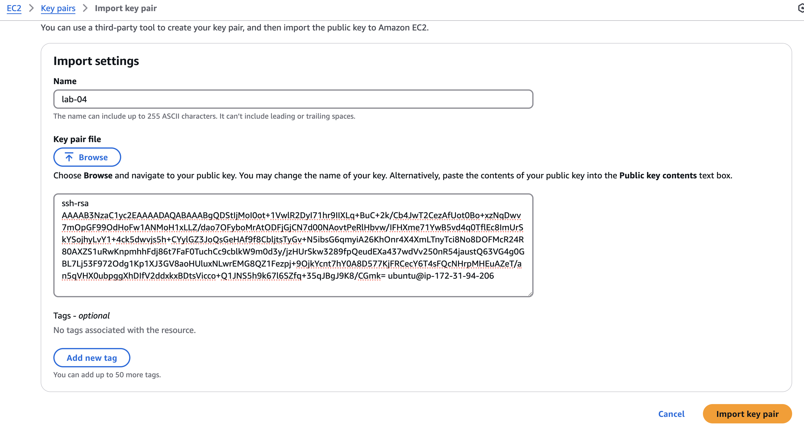
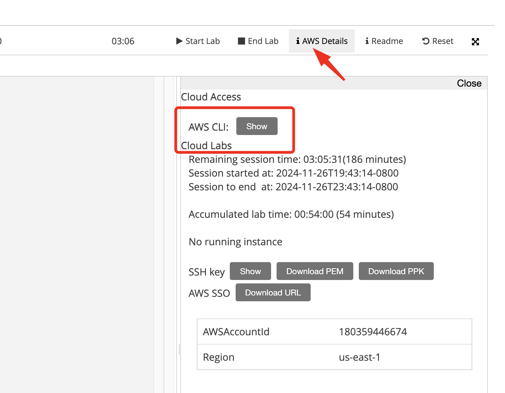
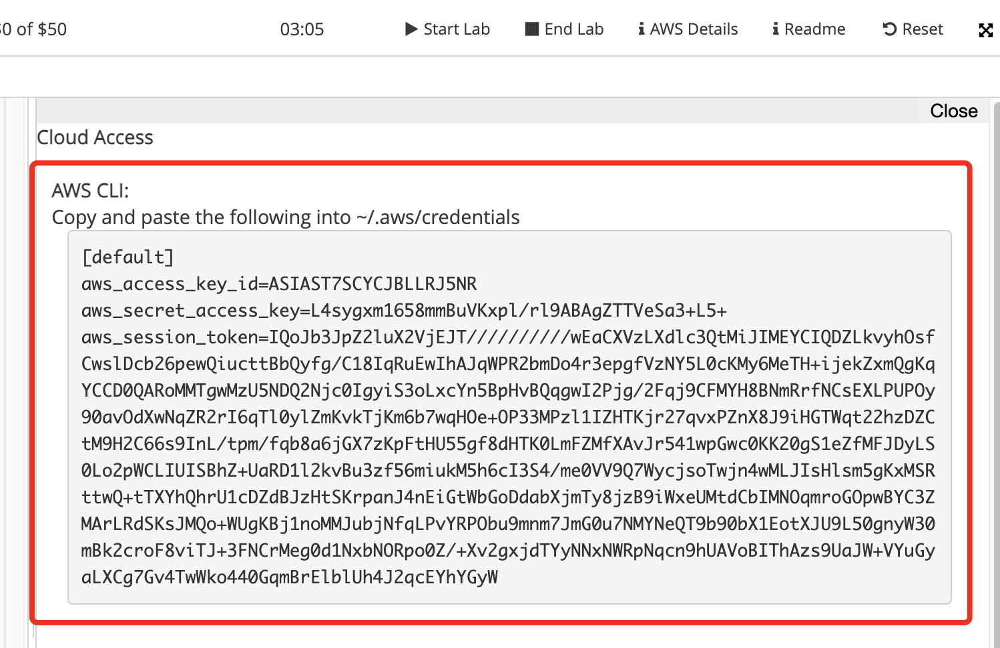
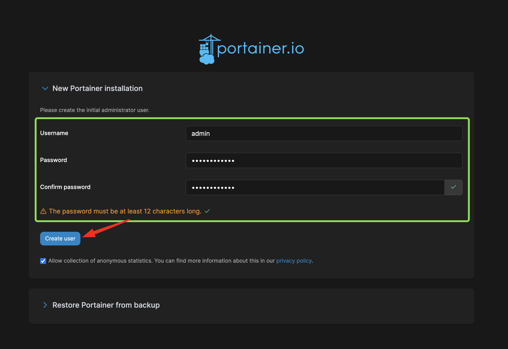
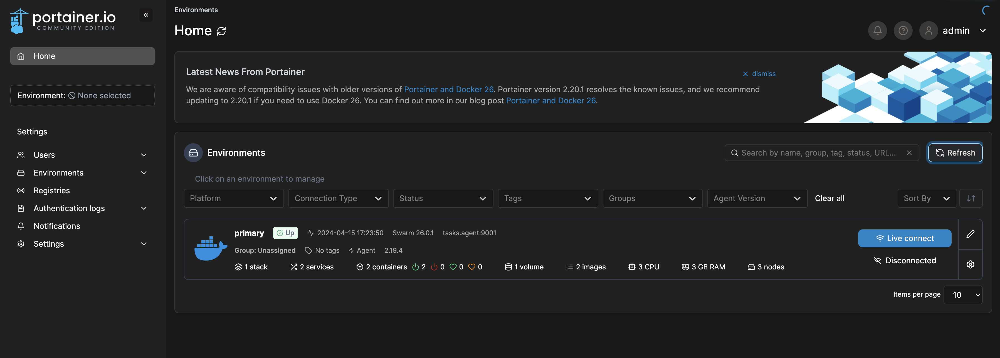

## Aula 4 - Docker Swarm

## Neste laboratório iremos automatizar a instalação e configuração de um Cluster Swarm.

Arquitetura:


## Provisionando um Cluster Swarm na AWS

1. Acesse o Cloud9, no terminal clone o repositório da disciplina:

```shell
git clone https://github.com/gersontpc/container-technologies.git
cd container-technologies/Lab-04/infra
```

2. Logo em seguida instale o `tfenv` para utilizar o terraform

```shell
git clone --depth=1 https://github.com/tfutils/tfenv.git ~/.tfenv
echo 'export PATH="$HOME/.tfenv/bin:$PATH"' >> ~/.bash_profile
echo 'export PATH="$HOME/.tfenv/bin:$PATH"' >> ~/.zprofile
echo 'export PATH=$PATH:$HOME/.tfenv/bin' >> ~/.bashrc
sudo ln -s ~/.tfenv/bin/* /usr/local/bin
```

3. Após a instalação iremos instalar a versão do terraform latest:

```shell
tfenv install latest
tfenv use latest
terraform --version
```

4. No arquivo `terraform.tfvars` preencha o `vpc_id`.


```tfvars
vpc_id = "vpc-07c02b093d5189367"
```

5. Crie uma chave SSH para serem utilizadas nas EC2 que iremos provisionar para os NÓS do cluster.


```
ssh-keygen

Generating public/private rsa key pair.
Enter file in which to save the key (/home/ubuntu/.ssh/id_rsa): [PRESSIONE ENTER]
/home/ubuntu/.ssh/id_rsa already exists.
Overwrite (y/n)? [PRESSIONE y + ENTER]
Enter passphrase (empty for no passphrase): [PRESSIONE ENTER]
Enter same passphrase again: [PRESSIONE ENTER]
Your identification has been saved in /home/ubuntu/.ssh/id_rsa
Your public key has been saved in /home/ubuntu/.ssh/id_rsa.pub
The key fingerprint is:
SHA256:KSgMEfSgskfSXwx6IQva0v7iDXKtRXXnPUrBzd1H6QU ubuntu@ip-172-31-94-206
The key's randomart image is:
+---[RSA 3072]----+
|=+. o         E.o|
|o*o+ +   . o . +.|
|B B.. + . + o o +|
|.O o + . + o   ..|
|. = + . S o o    |
| . =   . . . .   |
|. + +     .      |
| + *             |
|  o .            |
+----[SHA256]-----+
```

6. Altere a permissão do arquivo da chave que acabamos de criar
```shell
chmod 400 ~/.ssh/id_rsa
```

7. Copie a Chave SSH
```bash
cat ~/.ssh/id_rsa.pub
```

87. Copie o conteúdo:

```
ssh-rsa AAAAB3NzaC1yc2EAAAADAQABAAABgQDStIjMoI0ot+1VwlR2DyI71hr9IIXLq+BuC+2k/Cb4JwT2CezAfUot0Bo+xzNqDwv7mOpGF99OdHoFw1ANMoH1xLLZ/dao7OFyboMrAtODFjGjCN7d00NAovtPeRlHbvw/IFHXme71YwB5vd4q0TflEc8ImUrSkYSojhyLvY1+4ck5dwvjs5h+CYylGZ3JoQsGeHAf9f8CbljtsTyGv+N5ibsG6qmyiA26KhOnr4X4XmLTnyTci8No8DOFMcR24R80AXZS1uRwKnpmhhFdj86t7FaF0TuchCc9cblkW9m0d3y/jzHUrSkw3289fpQeudEXa437wdVv250nR54jaustQ63VG4g0GBL7Lj53F972Odg1Kp1XJ3GV8aoHUluxNLwrEMG8QZ1Fezpj+9OjkYcnt7hY0A8D577KjFRCecY6T4sFQcNHrpMHEuAZeT/an5qVHX0ubpggXhDIfV2ddxkxBDtsVicco+Q1JNS5h9k67l6SZfq+35qJBgJ9K8/CGmk= ubuntu@ip-172-31-94-206
```

9. Vá no Console da AWS

Clique em [EC2] > [Key Pairs] > [Actions] > [Import key pair]

Em nome coloque: `lab-04`  
No campo abaixo de `key pair file`  
Cole a chave pública.



Agora iremos importar as credenciais da AWS.

10. Vá até a página do Lab e clique em [i] AWS Details na sequência clique em Show.



11. Copie as credenciais.


12. Cole insira conforme o comando abaixo:

cat <<'EOF' > ~/.aws/credentials

[default]
aws_access_key_id=ASIAST7WWWYCJBLLRJ5NR
aws_secret_access_key=L4sygxmWWWWWBuVKxpl/rl9ABAgZTTVeSa3+L5+
aws_session_token=IQoJb3JpZ2luX2VjEJddddeediushpfbkWWWWWWWIPNEnekj...o440GqmBrElblUh4J2qcEYhYGyW

EOF

13. Cole no terminal e pressione [ENTER]


14. Agora iremos `terraform init` para baixar os plugins.

```shell
terraform init
```

Na sequência execute `terraform plan` e `terraform apply --auto-approve`

```shell
terraform plan
terraform apply --auto-approve
```

Output:
```shell
Plan: 4 to add, 0 to change, 0 to destroy.

Changes to Outputs:
  + manager_private_ips = (known after apply)
  + manager_public_ip   = (known after apply)
  + worker_private_ips  = (known after apply)
aws_security_group.swarm: Creating...
aws_security_group.swarm: Creation complete after 3s [id=sg-0b7efd8ea29bcb3fc]
aws_instance.swarm[1]: Creating...
aws_instance.swarm[2]: Creating...
aws_instance.swarm[0]: Creating...
aws_instance.swarm[2]: Still creating... [10s elapsed]
aws_instance.swarm[1]: Still creating... [10s elapsed]
aws_instance.swarm[0]: Still creating... [10s elapsed]
aws_instance.swarm[1]: Creation complete after 13s [id=i-0f965005aef5e26c4]
aws_instance.swarm[0]: Creation complete after 13s [id=i-013ba40a0fd5c48f3]
aws_instance.swarm[2]: Still creating... [20s elapsed]
aws_instance.swarm[2]: Still creating... [30s elapsed]
aws_instance.swarm[2]: Creation complete after 32s [id=i-02006fbeecdd0811a]

Apply complete! Resources: 0 added, 0 changed, 0 destroyed.

Outputs:

manager_private_ips = [
  "172.31.91.244",
]
manager_urls = {
  "URL-2048" = "http://52.87.233.223:8080"
  "URL-Portainer" = "http://52.87.233.223:9000"
}
worker_private_ips = [
  "172.31.82.209",
  "172.31.82.79",
]
```
15. Acesse o console de EC2 Instances e terá 3 instâncias em execução `swarm-master`, `swarm-node-00` e `swarm-node-01`.


16. No outputs do terraform terá o `mamager_public_ip` e `nodes_public_ip`, copie esses IPs e cole no arquivo: `ansible/hosts`, conforme abaixo:

Colocar os IPs conforme abaixo:

```ansible
[masters]
172.31.24.82

[workers]
172.31.27.66
172.31.86.208
```

17. Agora no Cloud9 iremos instalar o Ansible:

```shell
sudo apt update
sudo apt install software-properties-common
sudo add-apt-repository --yes --update ppa:ansible/ansible
sudo apt install ansible-core -y
```
Cheque se instalou tudo certo:

```shell
ansible-playbook --version
ansible-playbook [core 2.12.0]
```

Exporte a variável de ambiente para não pedir checagem da Key:
```
export ANSIBLE_HOST_KEY_CHECKING=false
```

18. Agora iremos executar o Ansible para configurar nosso Cluster Docker Swarm

Entre no diretório do ansible:

```shell
cd ../ansible/
```

Execute o `ansible-playbook` para configurar o Cluster.

```shell
ansible-playbook -i hosts playbook.yml
```
Output:
```
PLAY [Init Swarm Master] *************************************************************************************************************************************************************************************

TASK [Swarm Init] ********************************************************************************************************************************************************************************************
changed: [172.31.24.82]

TASK [Get Worker Token] **************************************************************************************************************************************************************************************
changed: [172.31.24.82]

TASK [Show Worker Token] *************************************************************************************************************************************************************************************
ok: [172.31.24.82] => {
    "worker_token.stdout": "SWMTKN-1-5shuvkz3p2muss18wez1cjnaaud152o838z0sjkl0vj5nky3ci-1bi7x6oizgg5gbwxyw92kzzo9"
}

TASK [Master Token] ******************************************************************************************************************************************************************************************
changed: [172.31.24.82]

TASK [Show Master Token] *************************************************************************************************************************************************************************************
ok: [172.31.24.82] => {
    "master_token.stdout": "SWMTKN-1-5shuvkz3p2muss18wez1cjnaaud152o838z0sjkl0vj5nky3ci-ennc8sxtyfzvducu0jopo9nfs"
}

PLAY [Join Swarm Cluster] ************************************************************************************************************************************************************************************

TASK [Join Swarm Cluster as a Worker] ************************************************************************************************************************************************************************
changed: [172.31.86.208]
changed: [172.31.27.66]

TASK [Show Results] ******************************************************************************************************************************************************************************************
ok: [172.31.27.66] => {
    "worker.stdout": "This node joined a swarm as a worker."
}
ok: [172.31.86.208] => {
    "worker.stdout": "This node joined a swarm as a worker."
}

TASK [Show Errors] *******************************************************************************************************************************************************************************************
ok: [172.31.27.66] => {
    "worker.stderr": ""
}
ok: [172.31.86.208] => {
    "worker.stderr": ""
}

PLAY RECAP ***************************************************************************************************************************************************************************************************
172.31.24.82               : ok=5    changed=3    unreachable=0    failed=0    skipped=0    rescued=0    ignored=0   
172.31.27.66               : ok=3    changed=1    unreachable=0    failed=0    skipped=0    rescued=0    ignored=0   
172.31.86.208              : ok=3    changed=1    unreachable=0    failed=0    skipped=0    rescued=0    ignored=0 
```

13. Conectando no Manager do Swarm

```shell
ssh 172.31.24.82
```

14. Listando os nós do cluster

```shell
docker node ls
ID                            HOSTNAME           STATUS    AVAILABILITY   MANAGER STATUS   ENGINE VERSION
jhqrikifs8iv7pybzsoywb905 *   ip-172-31-24-82    Ready     Active         Leader           26.0.1
ufokvxs98uope1yion0rek4mv     ip-172-31-27-66    Ready     Active                          26.0.1
wuy3t64bt1ntd35kwybbiuzux     ip-172-31-86-208   Ready     Active                          26.0.1
```
15. Fazendo o deploy do `Portainer` para conseguir visualizar o ambiente atrevés de UI.


```shell
cat <<'EOF' >> portainer-agent-stack.yml
version: '3.2'

services:
  agent:
    image: portainer/agent:2.19.4
    volumes:
      - /var/run/docker.sock:/var/run/docker.sock
      - /var/lib/docker/volumes:/var/lib/docker/volumes
    networks:
      - agent_network
    deploy:
      mode: global
      placement:
        constraints: [node.platform.os == linux]

  portainer:
    image: portainer/portainer-ce:2.19.4
    command: -H tcp://tasks.agent:9001 --tlsskipverify
    ports:
      - "9443:9443"
      - "9000:9000"
      - "8000:8000"
    volumes:
      - portainer_data:/data
    networks:
      - agent_network
    deploy:
      mode: replicated
      replicas: 1
      placement:
        constraints: [node.role == manager]

networks:
  agent_network:
    driver: overlay
    attachable: true

volumes:
  portainer_data:
EOF
```

16. Agora realize o deploy da stack do Portainer

```shell
docker stack deploy -c portainer-agent-stack.yml portainer
```

17. Listando as Stacks dentro do cluster

```shell
docker stack ls
```

18. Listando os serviços dentro do cluster

```shell
docker service ls
```

19. Agora vamos acessar o frontend do Portainer

No Outputs do Terraform, ele exibe as URLs que iremos utilizar, então clique na URL do portainer

```shell
manager_urls = {
  "URL-2048" = "http://52.87.233.223:8080"
  "URL-Portainer" = "http://52.87.233.223:9000"
}
```

20. Clique na URL `Portainer` e será redirecionado para o browser, onde irá carregar o frontend do Portainer


Em `Username` deixe o usuário `admin`  
Em `Password` coloque a senha: `012345678910` e `Confirme password` com a mesma senha  
Na sequência clique em `Create user`.



21. Navegue no frontend do portainer:



22. Crie uma stack com a sua imagem feita em sala de aula com o `2048`:


```shell
cat <<'EOF' > 2048-stack.yml
version: "3.9"

services:
  container-technologies:
    image: gersontpc/container-technologies:v1.0.0
    restart: always
    ports:
      - "8080:80"
    networks:
      - agent_network
    deploy:
      mode: replicated
      replicas: 1
      placement:
        constraints: [node.role == manager]

networks:
  agent_network:
    driver: overlay
    attachable: true
EOF
```

21. Realize o deploy da stack do 2048

```shell
docker stack deploy -c 2048-stack.yml 2048
```

22. Acesse o 2048 através do seu browser

No Outputs do Terraform, ele exibe as URLs que iremos utilizar, então clique na URL do portainer

```shell
manager_urls = {
  "URL-2048" = "http://52.87.233.223:8080"
  "URL-Portainer" = "http://52.87.233.223:9000"
}
```

Clique na URL 2048


23. Pratique os comandos que foi passado na apresentação! :)

24. E por ultimo vamos limpar a casa:


Remova as stacks que foram realziados o Deploy:

```shell
docker stack rm portainer 2048
```

Pressione a tecla `CTRL` + `D` para deslogar do servidor.

Destrua o ambiente utilizando o terraform:

```shell
cd ~/environment/container-technologies/Lab-04/infra/
terraform destroy --auto-approve
```

-----

É isso pessoal! Espero que tenha curtido a aula! :)