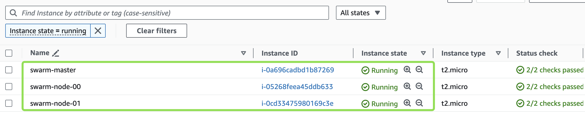

## Aula 4 - Docker Swarm

## Provisionando um Cluster Swarm na AWS

1. Acesse o Cloud9, no terminal clone o repositório da disciplina:

```shell
git clone https://github.com/gersontpc/container-technologies.git
cd container-technologies/Lab-04/infra
```

2. Logo em seguida instale o `tfenv` para utilizar o terraform

```shell
git clone --depth=1 https://github.com/tfutils/tfenv.git ~/.tfenv
echo 'export PATH="$HOME/.tfenv/bin:$PATH"' >> ~/.bash_profile
echo 'export PATH="$HOME/.tfenv/bin:$PATH"' >> ~/.zprofile
echo 'export PATH=$PATH:$HOME/.tfenv/bin' >> ~/.bashrc
sudo ln -s ~/.tfenv/bin/* /usr/local/bin
```

3. Após a instalação iremos instalar a versão do terraform latest:

```shell
tfenv install latest
tfenv use latest
terraform --version
```

4. Crie o arquivo `terraform.tfvars` para passar o valor das variáveis obrigatórias

no conteúdo do arquivo, adicione o VPC ID:

```tfvars
vpc_id = "vpc-07c02b093d5189367"
```

5. após realizar o vpc iremos executar o comando `terraform init` para baixar os plugins.

Na sequência execute `terraform plan` e `terraform apply --auto-approve`

Output:
```shell
...
aws_instance.manager: Creating...
aws_instance.nodes[1]: Creating...
aws_instance.nodes[0]: Creating...
aws_instance.manager: Still creating... [10s elapsed]
aws_instance.nodes[1]: Still creating... [10s elapsed]
aws_instance.nodes[0]: Still creating... [10s elapsed]
aws_instance.manager: Still creating... [20s elapsed]
aws_instance.nodes[1]: Still creating... [20s elapsed]
aws_instance.nodes[0]: Still creating... [20s elapsed]
aws_instance.manager: Still creating... [30s elapsed]
aws_instance.nodes[1]: Still creating... [30s elapsed]
aws_instance.nodes[0]: Still creating... [30s elapsed]
aws_instance.nodes[0]: Creation complete after 32s [id=i-05268feea45ddb633]
aws_instance.manager: Still creating... [40s elapsed]
aws_instance.nodes[1]: Still creating... [40s elapsed]
aws_instance.nodes[1]: Creation complete after 42s [id=i-0cd33475980169c3e]
aws_instance.manager: Creation complete after 42s [id=i-0a696cadbd1b87269]

Apply complete! Resources: 3 added, 0 changed, 0 destroyed.

Outputs:

mamager_public_ip = [
  [
    "54.210..107",
  ],
]
nodes_public_ip = [
  [
    "54.211.240.113",
    "54.234.91.114",
  ],
]
```
6. Acesse o console de EC2 Instances e terá 3 instâncias em execução `swarm-master`, `swarm-node-00` e `swarm-node-01`.




7. No outputs do terraform terá o `mamager_public_ip` e `nodes_public_ip`, copie esses IPs e cole no arquivo: `ansible/hosts`, conforme abaixo:

```ansible
[masters]
54.210..107

[workers]
54.211.240.113
54.234.91.114
```

8. Agora no Cloud9 iremos instalar o Ansible:

```shell
sudo apt update
sudo apt install software-properties-common
sudo add-apt-repository --yes --update ppa:ansible/ansible
sudo apt install ansible-core -y
```
Cheque se instalou tudo certo:

```shell
ansible-playbook --version
ansible-playbook [core 2.12.0]
```

```compose
version: '3.2'

services:
  agent:
    image: portainer/agent:2.19.4
    volumes:
      - /var/run/docker.sock:/var/run/docker.sock
      - /var/lib/docker/volumes:/var/lib/docker/volumes
    networks:
      - agent_network
    deploy:
      mode: global
      placement:
        constraints: [node.platform.os == linux]

  portainer:
    image: portainer/portainer-ce:2.19.4
    command: -H tcp://tasks.agent:9001 --tlsskipverify
    ports:
      - "9443:9443"
      - "9000:9000"
      - "8000:8000"
    volumes:
      - portainer_data:/data
    networks:
      - agent_network
    deploy:
      mode: replicated
      replicas: 1
      placement:
        constraints: [node.role == manager]

networks:
  agent_network:
    driver: overlay
    attachable: true

volumes:
  portainer_data:
```

```shell
docker stack deploy -c portainer-agent-stack.yml portainer
```