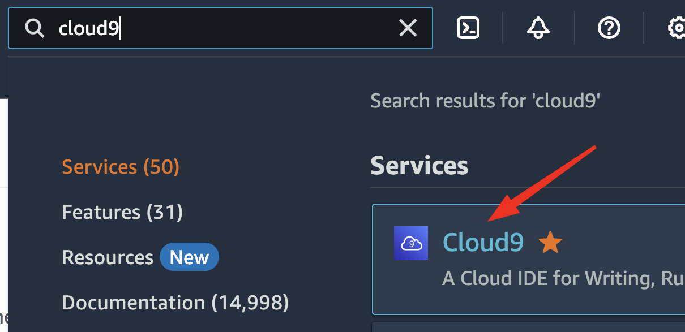
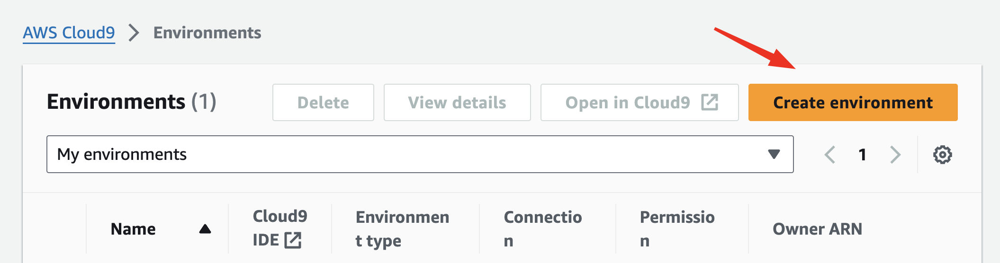
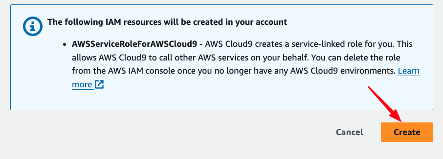
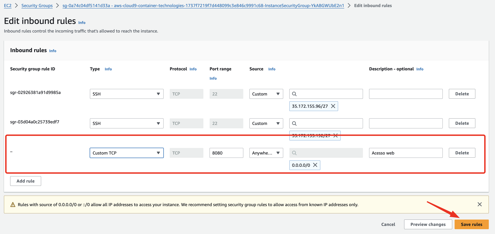
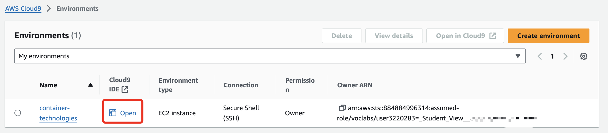

## Aula 3 - Container Technologies

### Preparando o ambiente no Cloud9

1. Criando o ambiente no Cloud9

Vá até serviços e pesquise por `Cloud9`



2. Em Cloud9 crie em `Create environment`:



3. Preencha os campos conforme as instruções abaixo:

- **Details:**  
**Name:** container-technologies  
**Environment type:** New EC2 instance  

- **New EC2 instance:**  
Selecione **Instance Type:** t3.small (2GiB RAM + 2vCPU)  
**Plataform:** Ubuntu Server 22.04 LTS  

- **Network settings**  
Selecione: **Secure Shell (SSH)**


4. E por último clique em **Create**



5. Aguarde a criação do ambiente


6. Enquanto cria o ambiente, vá no serviço EC2:


7. Selecione a instância criada `aws-cloud9-container-technologies-<ID/>`:
- Ao selecionar a instância, desça até a final da página e clique na aba **Security** e depois em  **Security Groups** clique no Segurity Group da instância.


8. No Security Group clique em **Edit inbound rules:**


9. Clique em **Save rules**, para salvar a regra criada



10. Vá novamente até o **Cloud9**, e clique em **Open**:



11. Conhecendo o **Cloud9**:


12. Clonando o repositório da aula:

No terminal do Cloud9, execute o comando abaixo:

```shell
git clone https://github.com/gersontpc/container-technologies.git
```

### Exercicio 3 - docker compose (Wordpress)

Após clonar o repositório, iremos acessar o diretório 

1. Acesse o diretório aula3:
```shell
cd container-technologies/aula3/
```

2. Execute o comando `docker compose up -d` para iniciar os serviços do wordpress

```shell
docker compose up -d
```

Conteúdo do **compose.yaml**:
```
version: "3.8"

services:
  mysql:
    image: mariadb:latest
    command: '--default-authentication-plugin=mysql_native_password'
    deploy:
      replicas: 1
    restart: always
    environment:
      MYSQL_ROOT_PASSWORD: senha1234
      MYSQL_DATABASE: wordpress
      MYSQL_USER: UserBlog
      MYSQL_PASSWORD: PwdBlog
    expose:
      - 3306
    volumes:
      - database:/var/lib/mysql
    networks:
      - wordpress

  wordpress:
    image: wordpress:latest
    deploy:
      replicas: 1
    restart: always
    environment:
      WORDPRESS_DB_HOST: mysql
      WORDPRESS_DB_USER: UserBlog
      WORDPRESS_DB_PASSWORD: PwdBlog
      WORDPRESS_DB_NAME: wordpress
    volumes:
      - wordpress:/var/www/html
    ports:
      - 8080:80
    networks:
      - wordpress
    depends_on:
      - mysql

volumes:
  database:
  wordpress:

networks:
  wordpress:
    driver: bridge

```
3. Após subir a stack do wordpress, acesse o

3. Setando os limites dos contêineres:

```docker-compose
version: "3.8"

services:
  mysql:
    image: mariadb:latest
    command: '--default-authentication-plugin=mysql_native_password'
    deploy:
      replicas: 1
      resources:
        limits:
          cpus: '1.5'
          memory: 1024M
        reservations:
          cpus: '1'
          memory: 512M
    restart: always
    environment:
      MYSQL_ROOT_PASSWORD: senha1234
      MYSQL_DATABASE: wordpress
      MYSQL_USER: UserBlog
      MYSQL_PASSWORD: PwdBlog
    expose:
      - 3306
    volumes:
      - database:/var/lib/mysql
    networks:
      - wordpress

  wordpress:
    image: wordpress:latest
    deploy:
      replicas: 1
      resources:
        limits:
          cpus: '1'
          memory: 512M
        reservations:
          cpus: '0.5'
          memory: 256M
    restart: always
    environment:
      WORDPRESS_DB_HOST: mysql
      WORDPRESS_DB_USER: UserBlog
      WORDPRESS_DB_PASSWORD: PwdBlog
      WORDPRESS_DB_NAME: wordpress
    volumes:
      - wordpress:/var/www/html
    ports:
      - 8080:80
    networks:
      - wordpress
    depends_on:
      - mysql

volumes:
  database:
  wordpress:

networks:
  wordpress:
    driver: bridge
```

### Exercício 4 - Cluster Docker Swarm